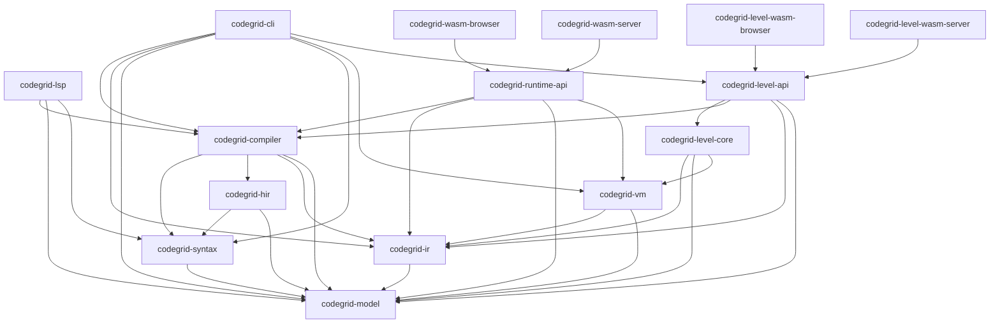

# CodeGrid Language Stack Architecture

## Delivery sequence

The local delivery target is the Full language over one shared compiler and VM, surfaced through `codegrid check`, `codegrid run`, the Rust LSP, VS Code, Runtime API, and browser/server WASM adapters. Existing host implementations cover only part of the Full language and must be revalidated against the expanded contracts.

The game repository owns game UI, level content, story, Steam integration, and telemetry. This repository owns the language and its host adapters. The Rust level evaluation layer owns logical level validation, ExactIO, constraints, and scoring above the language core; see the [Level Core architecture](level-core-architecture.md). Web, Steam, and backend hosts invoke that layer through WASM. Game code must not add a second source parser, validator, instruction table, interpreter, or level evaluator.

## Workspace layers

Create crates as their implementation milestone begins. Do not add empty placeholders solely to reserve directory names.

```text
codegrid/
  spec/                         Full source, VM, IR, and host specifications
  docs/                         Architecture, IR, decisions, roadmap, tests
  crates/
    codegrid-model/              Shared values and instruction inventory
    codegrid-syntax/             Lexer, source structure, UTF-8 byte spans
    codegrid-hir/                Resolved source-level representation
    codegrid-ir/                 Versioned executable representation and verifier
    codegrid-compiler/           Source validation and lowering to verified IR
    codegrid-vm/                 Deterministic tick engine and snapshots
    codegrid-cli/                Native check/run commands and host I/O
    codegrid-lsp/                Static editor-language services
    codegrid-runtime-api/         Versioned host requests and instance lifecycle
    codegrid-wasm-browser/        Browser ABI adapter
    codegrid-wasm-server/         Server ABI adapter
    codegrid-level-core/          Logical ExactIO policy above the language core
    codegrid-level-api/           Shared versioned level host operations
    codegrid-level-wasm-browser/  Browser Level binding v1
    codegrid-level-wasm-server/   Portable Level ABI v1
  editors/vscode/                TypeScript editor client without language semantics
  tests/                         Shared fixtures
  examples/                      Full language and migration programs
```

## Dependency direction

Every arrow means “depends on.”



Required constraints:

- `codegrid-model` depends on no higher layer.
- `codegrid-syntax` depends only on model; `codegrid-hir` may depend on model and syntax; `codegrid-ir` depends only on model.
- Compiler depends on HIR, IR, model, and syntax. VM depends only on verified IR and model.
- CLI composes compiler and VM directly at the process boundary. It may use syntax/model/IR types for diagnostics and result conversion, but it does not define language rules.
- LSP uses compiler and syntax APIs, never the VM. Runtime API composes compiler and VM for later host adapters.
- Browser and server adapters depend on Runtime API and contain only host ABI conversion and lifecycle glue.

Keep the dependency graph one-way and do not introduce dependency cycles or a parallel `codegrid-core` model. Every implemented crate and editor package has a local English `AGENTS.md` consistent with its actual Cargo/package dependencies.

## Shared semantic core

The source-to-execution pipeline is:

```text
UTF-8 source
    -> syntax and byte spans
    -> resolved HIR
    -> static validation and lowering
    -> verified IR
    -> deterministic VM
    -> CLI or a later host adapter
```

The source specification owns Full source acceptance. The model crate is the canonical Full instruction and attachment inventory. The compiler is the only source acceptance and IR construction path. The VM accepts only verified IR and receives explicit boundary mode, input, seed, limits, and initial state as data. It returns results without performing host I/O.

The semantic crates do not read paths, environment variables, networks, clocks, host randomness, or process state. They do not depend on CLI, LSP transport, editors, browsers, JavaScript bindings, operating-system I/O, game rules, `wasm-bindgen`, WASI, or a particular WASM runtime. Source spans remain UTF-8 byte offsets in core code; adapters convert them explicitly to editor position units.

## Version boundaries

Full version identities must be independently assigned and evolved:

| Contract | Full identity | Notes |
| --- | --- | --- |
| Source language | To be specified | Define whether `.cg` carries a version marker or the compiler selects the Full profile. |
| Executable IR | To be specified | Version the Full payload shape and require verifier validation. |
| Native CLI result | To be specified | Independent of source, IR, Runtime API, and WASM ABI versions. |
| Runtime API | To be specified | Host-neutral Full lifecycle contract used by both WASM adapters. |
| Server WASM ABI | To be specified | No-import contract, independent from Runtime API and CLI result versions. |

Do not infer source language support from an IR, Runtime API, or ABI version. Never treat Rust struct memory layout as a public interchange format.

## CLI boundary

`codegrid-cli` owns file access, argument parsing, input conversion, process exit codes, terminal diagnostics, and JSON serialization. It calls the shared compiler for `check` and `run`, then passes the resulting verified program and explicit run data to the shared VM. Full execution configuration includes boundary mode, input, seed, Custom execution limit, initial memory, and bounded outer ticks. Exact option spellings and result schema belong in the Full [CLI contract](cli.md).

Native CLI acceptance is separate from WASM portability and parity. A successful native CLI gate proves only the documented native behavior.

## LSP and WASM host boundaries

The LSP owns JSON-RPC transport and document lifecycle. It delegates Full source acceptance, symbols, and diagnostics to shared APIs and converts UTF-8 byte spans to UTF-16 positions at the protocol boundary. The editor extension remains a client and may not implement another parser, validator, instruction inventory, or interpreter.

Browser and server WASM hosts use the same semantic crates through versioned host data contracts. Each adapter owns only ABI conversion and host lifecycle. The server remains authoritative for server-controlled outcomes and compiles source itself or verifies a specified IR format. Handles are runtime-local, requests are bounded, and JavaScript `Number` must not carry wide integers, seeds, Page values, or memory addresses outside its exact integer range.

Runtime API, server ABI, and CLI results are separate versioned contracts. A `wasm32` compile alone establishes portability only; claim parity only after comparing results in actual native, browser, and server hosts.
