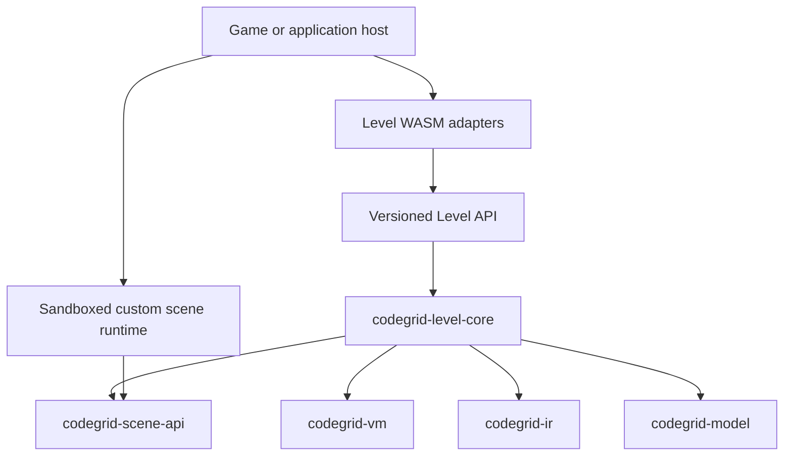

# Custom Scene Architecture

Status: architecture target for future implementation. Custom scene packages are
not currently loadable or executable. The current Level API v2 and its six
registered scenes keep their existing behavior. The selected Scene Level JSON
contract uses `format_version: 1` with no legacy scene-format branch; the current
loader, examples, and fixtures use this revision.

This document defines how CodeGrid should grow from a fixed Rust scene catalog
to player-authored scene packages while preserving the repository's shared Rust
evaluator, deterministic VM, host-neutral core, and thin WASM adapters. It is an
architecture decision, not a runtime wire specification. A later Scene API and
Level API contract must specify exact fields, errors, quotas, and conformance
vectors before implementation relies on them.

## Current boundary and the gap

Today `codegrid-level-core` owns scene validation and execution. Its schema and
scene catalog remain a closed `SceneKind` set, while the six built-in protocols
share a private object-safe transition interface inside `SceneMachine`.
`LevelApiV2` advertises only those compiled-in scene names. This works for the
current six official scenes, but a player package cannot register a new identity
or supply its own scene logic.

Custom scenes must not be added as more branches in the level loader, evaluator,
browser adapter, or server adapter. Nor should an arbitrary Rust dynamic
library be loaded into the process: Rust's native ABI is not a stable or safe
community plugin boundary. The extension point belongs between the generic
evaluator and a scene runtime, with package execution outside the language VM.

## Ownership and dependency direction

The intended runtime has four responsibilities:

| Layer | Owns |
| --- | --- |
| `codegrid-scene-api` (future, contract-only) | Stable scene/package identities and versioned, serializable scene-call, scene-reply, capability, metric, event, and view data. It must not depend on a WASM engine, host framework, or game UI. |
| `codegrid-level-core` | Level validation envelope, verified-program policy, VM lifecycle, deterministic tick processing, scene-call scheduling, atomic publication of accepted scene transitions and VM input, shared constraints/results, privacy, and case lifecycle. It must not load packages or execute guest modules. |
| `codegrid-level-api` | Versioned load/evaluate/resume lifecycle, validated handles, trusted resource profiles, and a resumable boundary for outstanding scene calls. It must not implement scene rules or host a plugin engine. |
| Game/application host | Resolves package references, runs custom scene modules in a sandbox, answers scene calls, renders declarative views, and owns installation, presentation, and trust policy. Browser and portable WASM adapters only convert their transport data. |

The future dependency direction is:

The diagram shows contract flow, not a Rust dependency from the guest binary.
`codegrid-scene-api` is data and protocol only. Official Rust scenes may use a
private in-process trait as an implementation detail, but that trait is not the
third-party ABI. Community packages use a versioned serialized protocol with a
WASM guest module. The exact guest calling convention is a later contract.

This boundary keeps the language crates unaware of scenes and keeps
`codegrid-level-core` independent of Wasmtime, browser APIs, JavaScript, WASI,
filesystem access, clocks, networking, and operating-system randomness.

## Shared evaluator with a cooperative scene host

The evaluator must not instantiate a nested WASM module. That would couple the
shared Rust evaluator to a particular runtime and would not work uniformly for
the current browser and no-import portable artifacts. Instead, a future Level
API version uses a cooperative call-and-resume loop:

1. The evaluator advances the VM using the existing deterministic tick
   transition. A rejected VM tick has no scene effects.
2. At a committed VM boundary, the evaluator yields a typed scene-call request
   when the scene needs to observe committed output, initialize a test case, or
   process termination. The request carries only explicit bounded data and the
   exact package identity needed by the host.
3. The host resolves and runs that package in its sandbox, then returns a
   versioned reply. The WASM adapters only carry this request/reply data; they
   do not interpret actions or scene rules.
4. The evaluator validates the reply envelope and declared limits, then
   publishes the candidate scene state, events, metrics, and any appended VM
   input together. Invalid replies become typed plugin/host failures. They are
   never disguised as player VM errors.
5. The host resumes the same evaluation handle. A host interruption preserves
   the committed VM boundary and outstanding call identity; it does not rerun
   a committed VM tick or publish a partial scene transition.

The call/reply contract should treat guest transitions as deterministic
state transformations: provide the prior bounded scene state and an explicit
event, and receive a candidate next state plus observation bytes, outcome,
metrics, and allowlisted events. The evaluator retains the accepted state as
opaque bounded bytes. This makes scene transitions replayable and prevents a
guest from committing hidden mutable state before the evaluator accepts its
reply. The protocol must include a unique pending-call identity so duplicate,
stale, or cross-evaluation replies can be rejected.

The evaluator remains responsible for VM-to-scene ordering. It processes only
committed output, preserves output order, appends scene observations behind
unread VM input, applies the existing session and privacy rules, and decides
when a test case starts or ends. A scene may define framing and action meaning
inside its own deterministic transition logic; it cannot change VM semantics,
read VM registers, inspect IR internals, or move/stop VM threads.

This cooperative boundary is required before community execution can be
advertised. Level API v2 has no outstanding scene-call state and remains the
fixed native-scene API; adding the bridge requires a separately versioned Level
API and transport contract. It does not silently alter the current v2 schema or
capabilities.

## Package, level, and replay identity

A community Scene is a versioned package; a level is data interpreted by that
package. The package should contain a manifest, one WASM runtime module, a
declarative editor schema, namespaced assets, localization data, and optional
examples. Package metadata and runtime protocol versions are separate from the
level author format, Level API, and WASM transport versions.

Each package reference must identify at least a stable namespaced ID, exact
package version, Scene API version, and cryptographic content digest. A level
and any replay/evaluation record pin that full identity. Resolving a mutable
"latest" package name at evaluation time is not deterministic. Package assets
and metric IDs are scoped to the package identity to prevent collisions.

Before the selected `format_version: 1` author contract is frozen and released,
it must carry the package reference separately from scene configuration and
test cases. The package owns domain validation for its configuration and cases;
the shared loader checks the common envelope, unknown/duplicate fields required
by the format, byte/count limits, and package identity. There is no need to
preserve the superseded format-2 scene draft. The Level API version remains
independent from this author-format decision. The current `SceneKind`,
`SceneConfig`, `SceneCaseData`, and `SELECTED_SCENES` are implementation details
of the fixed scene formats and are not a suitable extensibility contract.

## Validation, outcomes, metrics, and feedback

The common evaluator owns shared VM/program rules, session lifecycle, common
failure categories, cancellation, resource ceilings, result redaction, and
cross-case aggregation. Each scene owns validation of its domain data, its
observation/action protocol, world transition, goal, and scene-specific failure
details. These rules must be reached through the same Level API path for native
and guest scenes; hosts cannot implement a second evaluator in JavaScript or
application code.

Guest outcomes use a small common status vocabulary such as running, passed,
and failed. Scene-specific failure identifiers and details are namespaced by
the pinned package version and are structured data, never inferred from message
text. Plugin faults, invalid replies, quota exhaustion, and host/runtime faults
remain distinct from a player's invalid action or incomplete goal.

Scenes may declare scalar metrics with stable IDs, units, aggregation rules,
and optimization direction. The evaluator accepts only declared metrics,
checks arithmetic, and performs common aggregation and rating. A package cannot
ship executable scoring code, redefine core VM metrics, or add a scoring rule
that changes after the package digest is pinned. Hidden test details and hidden
metric contributions remain subject to the existing result privacy contract.

Debug feedback and rendering use bounded declarative event and view data. A
scene package does not draw to Canvas/WebGL, access the DOM, or supply arbitrary
editor scripts. Hosts render supported primitives and controls. The specific
editor schema and view vocabulary belong in a later versioned contract; this
repository does not define a game UI implementation.

## Sandbox, determinism, and trust

Community runtime modules are untrusted WebAssembly. The first supported
profile should grant no ambient permissions: no filesystem, network, clock,
thread creation, process access, or host RNG. Any randomness is derived from an
explicit host-provided seed and passed as deterministic input. The plugin
cannot access source code, VM registers, stacks, memory, or hidden results
except for data explicitly supplied for the current scene call.

The host sandbox enforces module size, linear memory, stack, fuel/work, state,
request/reply, event, and output ceilings. The evaluator independently checks
its own retained-state and input/output bounds. Safety limits are trusted host
configuration and cannot be relaxed by a level or package. Fuel exhaustion is
a resource outcome, not a player scene failure. Deterministic cross-host
execution requires a common metering contract and matching native, browser,
and server-runtime conformance evidence; compilation alone is not parity.

Custom package execution does not itself establish a leaderboard or official
certification policy. A trusted backend must resolve the same immutable
package digest and rerun the same evaluator contract before treating a result
as authoritative. Signing, distribution, moderation, and marketplace policy
belong to the game/application host and remain outside this language
repository.

## Migration and delivery gates

Keep current Level API v1/v2 transports unchanged. The selected scene author
format is v1 and its revised loader/examples still need migration. Add custom
package references to that pre-release v1 contract; do not create a legacy
compatibility branch for the superseded draft. Introduce the cooperative call
and resume lifecycle under a separately versioned Level API. Do not add player
package names to `SceneKind` or pretend that a compiled-in Rust registration is
package loading.

Before enabling custom scenes, the project must complete these gates:

1. Add the contract-only Scene API crate and update the workspace dependency
   graph and module rules. Define package identity, manifest, state, call/reply,
   outcome, metric, event, view, error, and exact serialization contracts.
2. Refactor the Level Core session around a generic scene transition boundary.
   A private object-safe seam now routes all six built-in scenes through the
   same transaction path; conformance must remain intact as guest call/resume
   support is added.
3. Add a versioned cooperative Level API that yields and resumes scene calls,
   with checked pending-call identities, opaque bounded state, cancellation,
   resource outcomes, and hidden-result projection.
4. Add host-owned package resolution and sandbox execution for native, actual
   browser, and actual server runtimes. Keep the existing WASM adapters as data
   conversion layers and retain the portable no-import ABI unless a separately
   reviewed contract changes it.
5. Add package and level validation, deterministic state-transition vectors,
   malicious/oversized guest cases, replay identity tests, privacy tests, and
   complete result comparison across all supported hosts.
6. Report capabilities only for packages the selected host can resolve and
   execute under the selected Scene API and safety profile.

Until these gates pass, the six current Rust scenes remain the only executable
scene set. `Scene Specification v1`, the selected [Scene Level JSON format
v1](../spec/codegrid-scene-level-json-v2.md), Scene Host Contract v2, and the
current conformance plan remain the normative authorities for those scenes.
