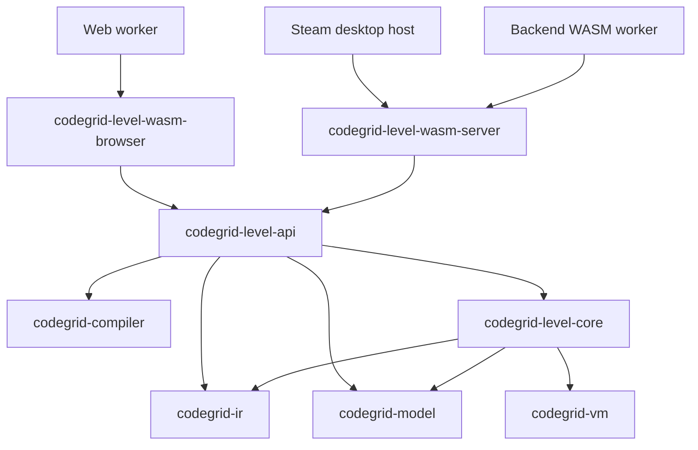

# Level Core Architecture

Status: ExactIO API v1 and six scene protocols through Level API v2 are
implemented, with initial browser/server host comparisons. The API-2 loader,
examples, and fixtures use the selected Scene Level JSON format v1. Remaining
verification limits are in the
[scene conformance plan](scene-conformance-plan.md) and
[task book](../tasks/level-core-exactio-v1.md).

The [Level Core v1 specification](../spec/codegrid-level-core-spec-v1.md)
defines evaluation behavior. The source and VM specifications continue to own
language acceptance, execution, raw metrics, and deterministic transitions.
This architecture implements the user's decision that level validation and
evaluation run in Rust, with Web, Steam, and backend callers using WASM.

The [delivery task book](../tasks/level-core-exactio-v1.md) tracks native CLI
level-file evaluation, scene host verification, and remaining parity evidence.
The CLI evaluate command calls the level API; existing language
check/run/debug commands retain their current composition and contracts.

The initial ExactIO/Environment design below predates the accepted six-scene
protocol and continuous-case work. Scene lifecycle and transitions are now
defined by the [Scene Spec](../spec/codegrid-scene-spec-v1.md),
[session design](scene-session-design.md), and
[six-scene architecture](level-scenes-architecture.md). In particular,
dynamic scenes retain one VM for a whole test case and reset between cases.
The future boundary for player-authored scene packages is in the
[Custom Scene architecture](custom-scenes-architecture.md).

## Ownership and dependencies

The [six-scene architecture](level-scenes-architecture.md) maps the selected
ExactIO, Baudot, QualityControl, Elevator, Robot, and MechanicalArm scenes to
the current Rust execution engines. API v2 advertises the six registered
scenes; API v1 remains ExactIO-only.

The future extension boundary for player-authored packages is described in the
[Custom Scene architecture](custom-scenes-architecture.md). Official scenes
share a private transition interface, but the closed schema/catalog remains a
built-in registration mechanism. Custom packages require a separately versioned
cooperative scene-call API; they are not loaded by the current catalog.

Keep the language workspace independent of game policy. The following
additional layers are implemented in this repository without changing the
existing language runtime adapters' contracts.



Every crate arrow means dependency; host arrows mean WASM invocation. These are
current Cargo dependencies. Level API also uses foundational IR/model types;
the native CLI evaluate command depends on the Level API.

| Component | Responsibility |
| --- | --- |
| `codegrid-level-core` | Decode and validate logical levels; check program rules against verified IR; execute ExactIO and the six registered scene protocols; aggregate metrics; enforce constraints; calculate ratings; produce privacy-safe results. Custom package loading and guest execution are future work. |
| `codegrid-level-api` | Versioned requests/results, source compilation through the existing compiler, validated-level and evaluation handles, explicit configuration, resource ceilings, bounded continuation, and lifecycle. |
| `codegrid-level-wasm-browser` | Browser binding conversion and lifecycle only; built for the browser WASM toolchain. |
| `codegrid-level-wasm-server` | Portable no-import byte ABI, bounded request/response buffers, and lifecycle only; usable in an embedded Steam runtime and a backend runtime. |
| Game hosts | Assets, presentation, localization, animation, persistence, authentication, leaderboard publication, Steam SDK calls, and host seed generation. |

The level core does not depend on `codegrid-runtime-api`, a transport, a game
host, OS I/O, clocks, host randomness, or WASM-specific libraries. It composes
the existing VM directly. The existing Runtime API remains a language execution
API; the new level API is a separate facade. Both reuse the same compiler and
VM rather than implementing parallel semantics. A shared neutral helper may be
extracted if needed without adding level dependencies to language crates.

Inside the level core, use `schema`, `validate`, `evaluate`, `metrics`, `scenes`,
and `result` modules as suggested by specification Appendix B. Keep scene logic
in Rust within this layer. Hosts may animate scene events but cannot decide
action validity, goals, metrics, or success.

## Rust trust boundaries and evaluation

Expose opaque `ValidatedLevel` values constructible only through level
validation. Accept only the existing `VerifiedProgram` type for execution.
Conceptual operations are:

```text
load_and_validate_level(json) -> ValidatedLevel or typed LevelError
validate_program(level, verified_program) -> accepted or ProgramRejected
start_evaluation(level, verified_program, mode, resolved_options) -> session
advance(session, work_budget) -> Pending or EvaluationResult
evaluate(level, verified_program, mode, resolved_options) -> EvaluationResult
```

`evaluate` drives the same session transitions as `advance`. A pending host
slice is not a player failure. Sessions retain an in-progress VM across host
slices. ExactIO creates a fresh VM per test; current dynamic scene sessions
retain one VM through the whole case and reset all VM/scene state between cases.
They retain only committed VM state: a work interruption rolls back the whole
attempted outer tick, including synchronous Custom work. The next call retries
that tick from its start; it cannot resume a partially executed Custom invocation.
Repeated budgets too small for one complete tick can make no progress. Hosts
must permit a larger retry budget within trusted ceilings or return a distinct
host resource outcome when those ceilings prevent progress. Never convert this
condition into a player runtime error or a successful evaluation.
The host facade compiles UTF-8 source once through `codegrid-compiler::compile`;
it does not accept unchecked IR. Compiler diagnostics remain distinct from
level loading errors and player evaluation failures.

Static validation checks format version before interpreting version-specific
fields, validates identifiers using the canonical model instruction inventory,
and checks metric and scene names against Rust registries. Unsupported versions
and scenes keep their dedicated error categories. Do not reject duplicate
tests or weak rating targets. Do not invent defaults for semantic fields.

Program checks inspect the verified program, including nested boards and Custom
contexts. They enforce only structural rules. Static metric constraints retain
the `ConstraintExceeded` classification rather than becoming program rejection.
The [ExactIO implementation contract](../spec/codegrid-level-exactio-contract-v1.md)
defines the independent Attachment whitelist and post-commit generated-code
guard. WriteCode is supported without changing VM commit/rollback semantics.

ExactIO selects visible tests in Debug and all tests in Official, shuffles using
a specified deterministic algorithm, and starts a fresh standard VM for every
test. Debug records every visible failure; Official stops at its first failure.
Process committed output in VM order after each atomic tick. A complete
nonempty expected sequence passes immediately; mismatch fails immediately;
empty expected output requires normal termination without output. Never split
or partially commit a VM tick to implement an output boundary.
Under VM sections 3 and 10, multiple writes to the outer output sequence in
one tick produce `ConcurrentOutputConflict`, including equal bytes. A runtime
error or conflict rejects the entire tick, and a VM fault prevents successful
commit; none supplies new committed output for correctness checks. Runtime
errors take precedence over a same-tick HALT. Only after a successful atomic
commit may an output complete a test or action; a same-tick committed HALT does
not undo that output. No additional output ordering or partial-tick success
semantics are introduced by the evaluator.

Dynamic scenes keep persistent Rust world state and a continuous VM per case.
Committed output is consumed in order; observations append to the VM input tail
without discarding unread bytes. The evaluator and scene apply the transactional
and actor-order rules in the [Scene Spec](../spec/codegrid-scene-spec-v1.md) and
[session design](scene-session-design.md). Goals, action framing, scene
failures, events, and scene metrics follow the current scene contracts. The
older fresh-VM-per-decision Environment sketch is retained above only as
historical Level Core v1 context.

## Metrics, limits, and results

A central level metric registry maps public metric names to existing VM raw
metrics or verified-program static measurements. Each entry defines scope,
aggregation (`SUM`, `MAX`, or `STATIC`), optimization direction, and applicable
constraint names. Scene entries are fixed per scene type. Levels cannot add
entries or redefine these properties. Do not implement `cost` by guessing a
formula from VM ticks or operations.

Only visible ExactIO tests contribute to official aggregates and level metric
constraints. Hidden tests contribute only to correctness and remain bounded by
global hard limits. Environment aggregates every decision step plus persistent
scene metrics. Failed evaluations may return permitted partial metrics but no
official final metrics or rating. Passing evaluations produce final metrics;
ratings use the minimum across rated metrics, and no targets means no rating.
Use checked integer arithmetic for the exact 3/2 and 2/3 threshold calculations;
define the accepted target range before implementing overflow behavior.

Keep three limit classes separate:

- Logical level constraints determine `ConstraintExceeded` from aggregated
  level metrics.
- Deterministic execution hard limits bound tests, Custom execution, and scene
  decisions, including hidden tests. `CustomExecutionLimitExceeded` is a VM
  runtime error and rolls back the attempted tick. VM `TickLimitReached` and
  host work exhaustion are nonterminal execution yields, not runtime errors.
  A separate cumulative evaluation safety ceiling may end an evaluation with
  a typed resource-limit outcome; its contract must distinguish that outcome
  from a per-call yield and from logical `ConstraintExceeded`.
- Host resource ceilings bound JSON bytes, level/test sizes, handles, retained
  VM/scene state, output, work slices, and response sizes. Resource interruption,
  cancellation, and VM faults are not wrong-output failures or official passes.

Level execution uses standard VM initial state, with no initial-memory or
register override exposed by the level API. Language-level boundary mode, VM
seed derivation, and hard limits are explicit resolved configuration. Slicing
must not change these values or reset random streams. Wall-clock deadlines
belong to hosts and cannot become scored execution metrics.

Return a unified typed result preserving `Passed`, `ProgramRejected`,
`LevelInvalid`, `TestFailed`, `RuntimeError`, `ConstraintExceeded`, and unsupported
capability categories. Preserve existing compiler/VM stable error identities;
assign new level errors at detection and publish them in the error registry
when the API is implemented. Include level identity/version, effective seeds,
evaluator contract/build identity, mode, effective execution configuration, and
permitted metrics so results can be reproduced.

## WASM contract and host integration

Version the level JSON format, level host API, browser binding, and portable
byte ABI independently of Runtime API v3 and Server ABI v4. Specify wire schemas
before implementation; do not expose Rust struct layouts. Proposed operations
are `capabilities`, `load_level`, `compile_program`, `start_evaluation`,
`advance_evaluation`, `evaluation_result`, handle release, and shutdown.
Handles are session-local and checked; bounded errors are complete responses.
Encode wide integers, handles, seeds, counters, and wide source offsets as
canonical decimal strings; bytes remain exact JSON numbers. Return UTF-8 spans
and convert at editor boundaries.

Web invokes the browser artifact in a worker and schedules bounded work slices.
Steam invokes the portable artifact through an embedded WASM runtime, or uses
the browser artifact if its game UI already has a compatible browser runtime.
The Steam SDK and save/achievement integration stay outside WASM evaluation.
The backend invokes the portable artifact in isolated workers with trusted
configuration. The concrete Steam and backend runtime selections belong to
their host projects; neither requires WASI imports in the evaluator.

If callers omit a seed, the host generates it and resolves it before entering
the deterministic Rust core through the level API evaluation entry point.
That entry point preserves the optional-seed convenience of Level Core section
49 using an explicit host-provided seed source; the deterministic evaluation
kernel receives only resolved seed data and never reads host randomness.
The returned seed is the actual effective seed.
Replay also records the VM random seed and any scene seed, the selected level
content revision, source content revision, evaluator identity, and limits.
The shuffle and seed derivation algorithm are fixed by the ExactIO contract
and have executable golden vectors in the evaluator tests.

Hidden tests cannot be kept secret when shipped to a client: `visible: false`
controls result disclosure, not asset secrecy. Ship only public debugging data
when secrecy matters. The backend loads its trusted full level by identity and
version, recompiles submitted source, and runs Official evaluation itself.
Client results cannot certify server-authoritative leaderboard records. Steam
achievements, offline progress, and save policies are decisions for the game
host, which may consume local WASM evaluation results. A public
subset must be represented explicitly in the host contract and cannot produce
a full official certification.

Hidden results must contain no input, output, index, order, snapshot, scene/VM
trace, or hidden metric contribution. Apply this restriction in core result
types and all progress/error projections. Keep any replay order private to the
trusted evaluator. Ordinary client debug execution may use the existing language
Runtime API, but official hidden evaluations must not expose its raw snapshots.

## Decisions required before implementation

This table is retained from the original ExactIO delivery planning. Scene
protocol, continuous-session, and API v2 design gaps were subsequently resolved
in the linked Scene Spec and host contracts; remaining implementation and
verification work is tracked in the current scene conformance plan.

The [ExactIO implementation contract](../spec/codegrid-level-exactio-contract-v1.md)
resolves the first-phase schema, capability mapping, metric registry (including
cost as Operation Count), shuffle/VM seeds, explicit Exit/Wrap configuration,
and terminal-tick priorities. The following remaining work does not block
implementing Rust ExactIO against that contract:

| Gap | Required decision |
| --- | --- |
| Implementation evidence | Shuffle golden vectors, committed Custom CodeChanged payload coverage, and host dispatch accounting; use the decided contracts and preserve VM semantics. |
| Environment completion boundaries | Action/goal completion plus a level constraint breach. ExactIO priorities are decided in its implementation contract. |
| Scenes | Complete scene specifications, initial goals, transitions, action schemas, and termination/safety rules. |
| Host contract | Level API/ABI versions, pending/cancel/resource outcomes, public-subset certification, and error registry additions. |

Automatic seed generation in specification sections 11 and 49 is implemented
through the level API and an explicit host seed source to preserve the
repository's deterministic core rule. The optional shuffle-seed public entry
point remains available; the evaluation kernel receives resolved seed data only.

### VM precedence for execution limits

The original Level Core section 15 listed `TickLimitExceeded` as an example
VM runtime error, and section 34 described global VM hard limits. The normative
VM sections 3 and 15 instead define bounded tick exhaustion as nonterminal
`TickLimitReached` and work exhaustion as a nonterminal host interruption;
neither makes the VM Error or changes interrupted-tick metrics. Runtime API
ceilings are host policy, not universal language limits.

For this architecture, follow the VM contract: continue per-call yields when
evaluation can progress, keep host resource termination separate, and apply
visible-only level tick constraints to aggregated metrics as
`ConstraintExceeded`. Do not synthesize a VM `TickLimitExceeded` error. A trusted
cumulative evaluation ceiling cannot be relaxed by a level and also applies
to hidden tests, but it must be specified as an evaluation/host safety policy.
The Level Core sections 15 and 34 now explicitly follow these VM rules; the
ExactIO implementation contract specifies the separate evaluation safety policy.

## Implementation and acceptance sequence

1. Use the decided ExactIO implementation contract to publish focused schema,
   capability, metric, atomic boundary, seed, and limit fixtures.
2. Implement `codegrid-level-core` validation and ExactIO with native focused
   tests, including fresh-state isolation, fail-fast, hidden redaction, constraints,
   metrics, and rating boundaries.
3. Implement bounded sessions and `codegrid-level-api`; test that slice sizes do
   not change completed results, errors, seeds, metrics, or scene transitions
   when budgets allow progress. Test insufficient-budget rollback and retry,
   including a Custom invocation larger than the initial slice, and distinguish
   pending progress from terminal host resource exhaustion.
4. Implement both level WASM adapters, then integrate Web, Steam, and backend
   host projects without adding host semantics.
5. Specify and implement each Environment scene separately, with deterministic
   transition fixtures and action failure cases.
6. Compare identical fixtures in native Rust, an actual browser WASM runtime,
   the actual Steam embedding runtime, and the actual backend WASM runtime.

Acceptance compares complete permitted results, errors, seeds, metrics, ratings,
and visible scene events, including wide integers and resource lifecycle. Add
negative tests proving hidden data cannot escape through results, progress,
snapshots, errors, or partial metrics. Existing language host parity evidence
does not establish level parity. WASM compilation alone is insufficient.
