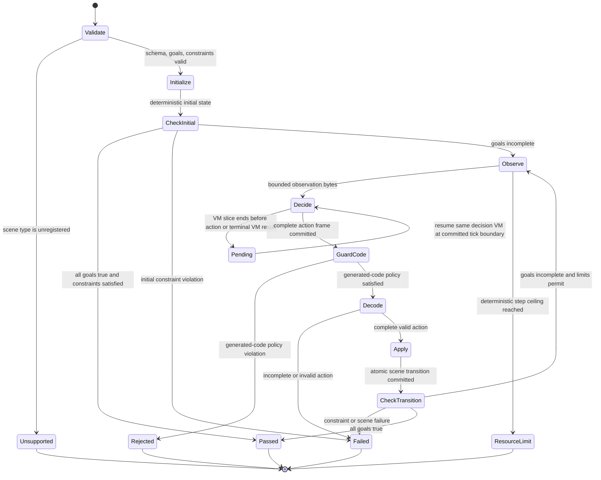

# Level Environment Extension Design

Status: historical internal WP3 design. The current scene protocols are
defined by the Scene Spec and shared session architecture; this document's
earlier reset-based Environment sketches and static-Rust-only registration do
not describe the current runtime. Player-authored packages follow the separate
[Custom Scene architecture](custom-scenes-architecture.md).

The authorities are the [Level Core v1 specification](../spec/codegrid-level-core-spec-v1.md),
the [ExactIO implementation contract](../spec/codegrid-level-exactio-contract-v1.md),
the [level architecture](level-core-architecture.md), and the
[delivery task book](../tasks/level-core-exactio-v1.md). This document supplies
an internal design sketch only. If implementation evidence reveals a semantic
gap, record the decision in the [decision log](decisions.md) and update the
normative specification before relying on the new interpretation.

## Later scene protocol decision (2026-10-05)

The [Scene Specification v1](../spec/codegrid-scene-spec-v1.md) now defines
the selected scene protocols. Its continuous VM per case and queue-tail
input appends supersede the fresh-VM-per-decision lifecycle sketches below
for Robot and MechanicalArm. Retain those sketches as historical
interface design; adapt them before implementation. Typed author JSON is now
defined by the selected [Scene Level JSON format v1 contract](../spec/codegrid-scene-level-json-v2.md).
The continuous session, input append, and versioned public projections are now
implemented in Level API v2. The accepted [continuous session design](scene-session-design.md)
and [scene conformance plan](scene-conformance-plan.md) document the current
behavior and remaining evidence gaps.
Their per-tick append, actor-order validation, partial actor effects, and
terminal priority replace the corresponding old sketches below. This document
predates the current API-2 scene implementation and is retained as design
history, not a statement of current runtime capability.

## Design boundary

Environment support belongs to `codegrid-level-core`. A scene owns its data
schema, persistent state, observation bytes, action framing and decoding,
transition rules, goal predicates, scene failures, scene metrics, and public
logical events. The shared evaluator owns source compilation, program
validation, standard VM creation, committed output collection, generated-code
checks, work slicing, shared metric aggregation, constraints, result status,
resource accounting, cancellation, and session lifecycle.

Hosts can list scene capabilities, load levels, and advance or release a
session through the shared level API. They do not register JavaScript callbacks
or decide whether an action, goal, metric, or result is valid. The scene
registry is compiled Rust code. A new production scene requires a separate
normative scene contract and Rust implementation; adding it must not require a
new host evaluation algorithm or top-level API.

The language compiler, IR, model, and VM remain independent of levels. Scene
code receives only validated data, explicit seeds, bounded byte buffers, and
typed limits. It performs no filesystem, network, clock, or host-randomness
access. Verified IR remains the only executable VM input.

## Typed scene registration and validation

The registry exposes a stable capability projection derived from its built-in
scene descriptors. A capability entry reports the exact scene type and
protocol version, supported goals and constraints, metric definitions, and
declared resource bounds. Unknown scene names return `UnsupportedSceneType`;
they never enter an ExactIO path. A descriptor is not evidence that a scene is
production-ready unless its normative specification is approved.

The public shapes below are illustrative Rust, not a promised wire schema:

```rust
#[derive(Clone, Debug, Eq, PartialEq, Ord, PartialOrd, Hash)]
pub struct SceneTypeId(String);

#[derive(Clone, Debug)]
pub struct EnvironmentCapabilities {
    pub evaluator_contract: ContractIdentity,
    pub scenes: Vec<SceneCapability>, // sorted by SceneTypeId
}

#[derive(Clone, Debug)]
pub struct SceneCapability {
    pub scene_type: SceneTypeId,
    pub protocol_version: u32,
    pub metrics: Vec<MetricDefinition>,
    pub goals: Vec<GoalDefinition>,
    pub constraints: Vec<ConstraintDefinition>,
    pub limits: SceneResourceBounds,
}

pub struct ValidatedScene(Arc<dyn ValidatedSceneData + Send + Sync>);
pub struct ValidatedGoals(Arc<dyn ValidatedGoalData + Send + Sync>);

pub enum SceneFailure {
    Terminal(SceneFailureCode),
    Resource(ResourceFailure),
    Invariant(EvaluatorFault),
}

pub enum ActionDecodeFailure {
    Invalid(InvalidActionCode),
}
```

Constructors for validated values are private to the validation layer. The
decoder first applies the Level Core format-version dispatch and bounded strict
JSON rules, then resolves the exact `scene_type` in the compiled registry, and
then calls that scene's typed validator for `scene_data`, `goals`, and its
constraint fields. The validator rejects unknown fields, invalid ranges,
duplicate identifiers, oversized collections, unsupported capabilities, and
invalid metric references with field paths. It returns immutable normalized
data. It must not initialize a world or return an execution-ready value for an
unsupported scene.

Use typed scene implementations behind a private registry adapter. A scene
author implements associated types for validated definition, persistent
state, action, and goal data; the adapter erases those types only inside the
core registry. Registration is static and reviewed, not caller-supplied.

```rust
trait EnvironmentScene: Send + Sync + 'static {
    type Definition: Send + Sync + 'static;
    type Goals: Send + Sync + 'static;
    type State: Send + 'static;
    type Action: Send + 'static;

    const CAPABILITY: &'static SceneCapability;

    fn validate(
        raw: RawSceneDefinition,
        limits: &SceneResourceBounds,
    ) -> Result<(Self::Definition, Self::Goals), SceneValidationError>;

    fn initialize(
        definition: &Self::Definition,
        seed: SceneSeed,
    ) -> Result<Self::State, SceneFailure>;

    fn observe(
        state: &Self::State,
        out: &mut BoundedBytes,
    ) -> Result<(), SceneFailure>;

    fn action_frame_len(definition: &Self::Definition) -> NonZeroUsize;
    fn decode_action(bytes: &[u8]) -> Result<Self::Action, ActionDecodeFailure>;
    fn apply_atomically(
        definition: &Self::Definition,
        state: &Self::State,
        action: &Self::Action,
        limits: &SceneResourceBounds,
    ) -> Result<SceneTransition<Self::State>, SceneFailure>;

    fn goals_satisfied(state: &Self::State, goals: &Self::Goals) -> bool;
    fn constraints(
        state: &Self::State,
        goals: &Self::Goals,
    ) -> Vec<ConstraintObservation>;
    fn metric_updates(
        before: Option<&Self::State>,
        after: &Self::State,
    ) -> Vec<MetricUpdate>;
    fn public_events(
        transition: &SceneTransition<Self::State>,
        out: &mut BoundedEvents,
    );
}
```

`SceneTransition` carries a fully formed next state and an ordered bounded list
of logical event values. `apply_atomically` must not mutate the old state; the
orchestrator installs the next state only after every transition check and
metric update succeeds. Malformed or illegal actions map to
`TestFailed(InvalidAction)`; scene-defined terminal failures map to a typed
scene subreason under `TestFailed`; scene/resource accounting failures map to a
resource outcome; invariant violations map to evaluator faults. Only the
scene's `decode_action` and `apply_atomically` decide scene action legality.
Stable error identities are assigned at detection as required by the error
registry.

Capabilities and validated data are opaque at the host boundary. The core can
use typed internal dispatch without exposing Rust struct layout, `Any`
downcasts, or callbacks in a wire contract. The registry must return stable,
sorted capability lists and reject duplicate scene IDs, metric IDs, goal IDs,
and constraint IDs at build/test time.

## Shared session and ownership

ExactIO and Environment use one top-level evaluator session and terminal
result model. Their evaluation state is a tagged variant, so a validated
Environment can never be interpreted as ExactIO:

```rust
pub enum EvaluationKind {
    ExactIo(ExactIoSession),
    Environment(EnvironmentSession),
}

pub enum EvaluationStatus {
    Pending,
    Passed,
    Failed(EvaluationFailure),
    ResourceLimitExceeded(ResourceFailure),
    Cancelled,
    Fault(EvaluatorFault),
}

pub enum EvaluationFailure {
    ProgramRejected(ProgramRejection),
    TestFailed(TestFailure),
    RuntimeError(VmErrorIdentity),
    ConstraintExceeded(ConstraintFailure),
    UnsupportedCapability(CapabilityFailure),
}

pub struct EnvironmentSession {
    scene: Box<dyn ActiveScene>,       // persistent Rust state
    decision: Option<DecisionSession>, // at most one live decision VM
    vm_metrics: MetricAccumulator,
    scene_metrics: MetricAccumulator,
    decision_index: u64,
    action_bytes: BoundedBytes,
    limits: Arc<TrustedSafetyProfile>,
    seeds: ResolvedEnvironmentSeeds,
}

struct DecisionSession {
    vm: VmSession,                     // standard VM, local to this decision
    committed_work: DecisionWork,
}
```

The core owns validated program, session phase, VM, scene state, accumulators,
bounded pending events, and trusted profile for the session lifetime. Immutable
scene definitions can be shared with `Arc`. One decision VM retains its
committed VM state across host `advance` calls. A tick interrupted by a
per-call work budget rolls back as specified by the VM; the next slice retries
the whole tick. The evaluator never resumes a partially run tick or Custom
invocation. When the decision yields a complete action, the VM is dropped
before the scene transition is committed. Only scene state and level-wide
aggregates persist into the next decision.

All decisions use normal byte input and normal VM output. Each gets standard
VM initial registers, stacks, code state, and memory; its input queue is the
scene observation bytes. No scene-specific VM channel or initial-state
override exists. Existing compiler acceptance, VerifiedProgram checks, VM
errors, metrics, tick behavior, and attachments keep their language contracts.

## Evaluation transitions

The common session lifecycle is `Validated -> Running -> Pending* -> Terminal
-> Released`. `advance` may return `Pending` after a host work slice without
changing the semantic evaluation outcome. Cancellation and release drop the
active VM, scene state, output frame, and buffered events. Terminal sessions
retain only the bounded result projection required by the API; release frees
that projection too.

Environment uses the following transition sequence:



Before each decision, encode the current scene observation into a bounded byte
buffer and create a fresh standard VM with its decision seed. Collect only
committed output bytes. A work interruption contributes no output or metrics
from the interrupted tick. After a successful VM tick, record permitted raw
metrics and check every committed WriteCode mutation (including transient
Custom-context changes) before accepting newly committed output. Generated
instruction rejection is `ProgramRejected`; it does not roll back the already
committed VM tick or become a VM error.

The first complete action frame ends that decision immediately. The remaining
program is not executed. Decode the fixed number of bytes required by that
scene's protocol. If the VM terminates before the frame is complete, return
`TestFailed(IncompleteAction)`; if the frame has an illegal value, return
`TestFailed(InvalidAction)`. These are player failures, not runtime errors or
structural program rejection. A VM runtime error or fault retains its existing
identity and takes precedence over an action that was not committed.

Apply a valid action to a candidate state, then atomically publish that state,
scene metric updates, and permitted logical events. Rejected actions do not
partially mutate the persistent scene. Evaluate all configured constraints
against the current Level aggregate, then evaluate the AND of all configured
goals. If constraints and goals both become true at one transition, the
recommended policy is constraint failure before success. If all goals are
already true after deterministic initialization, pass without running a VM,
provided initial constraints are satisfied. If constraints are already
irreversibly violated, fail before the first decision.

The exact precedence between a simultaneous goal completion and an
irreversible constraint breach is not settled by Level Core §28 or the
ExactIO contract. The ordering above is a recommended decision for the first
normative Environment scene contract, not a claim that the current
specification already decides it. That contract must also state whether
scene-specific terminal failures precede the level constraint check, and how
an observation/action buffer failure is reported. Do not implement a different
priority silently.

Every dynamic decision has a positive deterministic step ceiling from the
trusted safety profile. A level metric constraint such as `max_ticks` remains a
logical `ConstraintExceeded`; exhaustion of the evaluator's hard decision,
work, state, or byte ceiling is a typed resource outcome. Per-call VM tick/work
yields remain `Pending` while progress is possible. At an exact cumulative
ceiling, allow a completed evaluation that requires no more work to finish;
otherwise terminate with the resource outcome. Wall-clock deadlines remain
host cancellation policy and never become scene metrics.

## Determinism, replay, and privacy

Resolve the optional root seed at the level API boundary through its explicit
host seed source. The core receives only resolved seed values. Environment
replay identity records the root seed, scene initialization seed, decision VM
seed derivation identity, effective boundary and VM limits, scene type and
protocol version, level revision, program revision, evaluator identity, and
trusted safety-profile identity.

Give scene initialization and decision VMs distinct deterministic seed
domains. A future normative contract should define domain labels, integer
encoding, derivation algorithm, decision-index width/wrap behavior, and golden
vectors. Derive each decision seed from the root seed and stable decision index
so host slicing or a failed call retry cannot shift later streams. Do not use
one mutable PRNG stream whose consumption by one component changes another
component's sequence. ExactIO's shared-per-test VM seed rule does not silently
define Environment seed derivation.

Observations are internal VM input; action bytes are internal evaluator data.
Neither is copied into public progress or results by default. Public logical
events use stable event kinds and only scene-approved bounded fields. They do
not contain VM snapshots, raw observation/action payloads, asset references,
animation state, user-interface selection, wall-clock timing, or Steam data.
Any scene that needs public event values must whitelist and bound each field in
its normative contract. Hidden ExactIO privacy rules remain unchanged.

Bound raw JSON, scene entities, validated scene state, observation bytes,
action bytes, output accumulation, transitions, logical events, metric entries,
serialized responses, and retained sessions through the immutable trusted
safety profile. Scene-defined state growth and event construction are charged
to host resource accounting, never to VM Operation Count or other normative VM
metrics. On cancellation, resource termination, fault, or release, discard
pending uncommitted transitions and release all scene/VM buffers.

## Metric registration and integration

Metric identity is qualified by owner namespace to prevent a scene name from
colliding with a VM or static-program metric:

```text
vm.ticks
vm.cost
program.non_empty_cells
scene.<canonical-scene-id>.<scene-metric-id>
```

Inside the core, validated constraint and scoring definitions refer to
registered `MetricId` values; they do not create metrics or redefine metric
type, aggregation, optimization direction, scope, or applicability. Their
level-facing names are schema-defined aliases resolved to those IDs. Constraint
IDs are a separate namespace. ExactIO's published metric names and their
existing compatibility remain unchanged. Environment capability output
includes fully qualified metric IDs and the constraints that each scene
permits. Reject collisions and unregistered references during level
validation.

```rust
pub enum MetricValue {
    Unsigned(u64),
}

pub enum MetricAggregation {
    Sum,
    Max,
    Static,
}

pub enum OptimizationDirection {
    Minimize,
    Maximize,
}

pub struct MetricDefinition {
    pub id: MetricId,
    pub value_type: MetricValueType,
    pub scope: MetricScope,
    pub aggregation: MetricAggregation,
    pub direction: OptimizationDirection,
    pub valid_constraints: &'static [ConstraintId],
}

pub struct MetricUpdate {
    pub id: MetricId,
    pub value: MetricValue,
}
```

All aggregation uses checked arithmetic and deterministic key ordering.
Overflow is a typed evaluator failure, never wrapping or saturating arithmetic;
its stable external error identity belongs in the level error contract. Each
VM decision contributes its completed raw metrics to the shared Level
accumulator. `SUM` adds decision totals, `MAX` retains the maximum observed
decision value, and `STATIC` is computed once from the accepted VerifiedProgram
and is not multiplied by the number of decisions. A scene reports transition
deltas for `SUM` and values suitable for `MAX`; it must not repeatedly add a
cumulative state snapshot. Scene metrics are read from the persistent scene
state and aggregated according to their registered definitions.

Illustrative test-only registration, not a production scene or supported
capability:

| Metric ID | Type | Scope and aggregation | Direction | Applicable constraint |
| --- | --- | --- | --- | --- |
| `vm.cost` | unsigned integer | all completed Environment decisions, `SUM` | minimize | `max_cost` |
| `program.non_empty_cells` | unsigned integer | accepted program, `STATIC` once | minimize | `max_program_cells` |
| `scene.test_fixture.moves` | unsigned integer | persistent scene transition count, `SUM` | minimize | `max_fixture_moves` |
| `scene.test_fixture.items_reached` | unsigned integer | persistent high-water mark, `MAX` | maximize | `min_items_reached` |

At each committed action, the evaluator merges that decision's `vm.cost`,
merges scene transition deltas, and evaluates every configured constraint
against the Level aggregate. If a goal becomes true at the same point as a
constraint is breached, use the Environment precedence decision recorded by
the scene contract. A failed evaluation can expose only permitted partial
metrics and never official final metrics or a rating. A passing evaluation
uses the shared rating implementation and fixed metric direction/target rules.

## Shared result and cleanup

ExactIO and Environment return one `EvaluationResult` envelope with the same
status, typed failure, diagnostics, constraints, partial/final metric fields,
optional rating, effective configuration, replay identity, and evaluator
identity. Environment may add a bounded `EnvironmentResult` projection with a
decision count and allowlisted logical events. It does not return a second
scoring result or an unrestricted scene-state dump.

`Pending` is a session state, not a player failure. A completed action,
goal-completion check, constraint failure, invalid action, scene failure,
resource outcome, cancellation, and VM fault each have typed paths through the
same terminal lifecycle. Official metrics and rating exist only on a pass.
Release is idempotent at the API boundary; cross-session and stale handles
remain API errors and do not alter evaluation semantics. Hosts serialize wide
integers in the versioned level transport contract and return complete bounded
responses rather than truncating a result.

## Level Core sections 18–33 traceability

| Level Core section | Environment extension design mapping |
| --- | --- |
| [18. Environment Evaluation](../spec/codegrid-level-core-spec-v1.md#18-environment-evaluation) | Top-level tagged evaluator path and explicit persistent-scene ownership. |
| [19. Scene Types](../spec/codegrid-level-core-spec-v1.md#19-scene-types) | Compiled typed registry, capability descriptor, and explicit unsupported-scene result. |
| [20. Environment Data Model](../spec/codegrid-level-core-spec-v1.md#20-environment-data-model) | Separate immutable validated scene data, goals, and level constraints. |
| [21. Environment Goals](../spec/codegrid-level-core-spec-v1.md#21-environment-goals) | Typed goal state and all-configured-goals AND check. |
| [22. Environment Execution Model](../spec/codegrid-level-core-spec-v1.md#22-environment-execution-model) | Shared session transitions and persistent scene with one VM per decision. |
| [23. Environment VM Reset](../spec/codegrid-level-core-spec-v1.md#23-environment-vm-reset) | Standard initial VM per decision; only scene state and level aggregates persist. |
| [24. Observation Protocol](../spec/codegrid-level-core-spec-v1.md#24-observation-protocol) | Scene-owned bounded encoding into the normal `u8[]` input queue. |
| [25. Action Protocol](../spec/codegrid-level-core-spec-v1.md#25-action-protocol) | Scene-fixed output frame length and typed action decoder. |
| [26. Dynamic Step Completion](../spec/codegrid-level-core-spec-v1.md#26-dynamic-step-completion) | Stop on first committed complete action, discard the decision VM, transition atomically. |
| [27. Incomplete and Invalid Actions](../spec/codegrid-level-core-spec-v1.md#27-incomplete-and-invalid-actions) | Typed `TestFailed` action reasons kept distinct from VM/runtime and program rejection. |
| [28. Environment Completion and Failure](../spec/codegrid-level-core-spec-v1.md#28-environment-completion-and-failure) | Initial-goal check and recommended constraint-before-goal priority, flagged for normative resolution. |
| [29. Metrics](../spec/codegrid-level-core-spec-v1.md#29-metrics) | Central VM/static registry plus fixed per-scene metric vocabulary. |
| [30. Metric Aggregation](../spec/codegrid-level-core-spec-v1.md#30-metric-aggregation) | Registered `SUM`, `MAX`, or `STATIC`, checked and deterministic aggregation. |
| [31. Metric Scope](../spec/codegrid-level-core-spec-v1.md#31-metric-scope) | VM metrics across completed decisions plus persistent scene metrics. |
| [32. Constraints](../spec/codegrid-level-core-spec-v1.md#32-constraints) | Registered metric references and AND evaluation under fixed applicability. |
| [33. Constraint Scope](../spec/codegrid-level-core-spec-v1.md#33-constraint-scope) | Constraints evaluated on the current/final Level aggregate, with immediate irreversible-breach termination. |

## Scene author checklist

Before a scene can be registered as supported, its separate normative
specification and Rust implementation must establish all of the following:

- A stable scene type ID and protocol version; exact bounded `scene_data`,
  goal, and scene-constraint schemas; unknown-field, duplicate-ID, range, and
  numeric-overflow behavior.
- A deterministic initializer, complete state bounds, seed domain and golden
  vectors, and an explicit rule for goals already satisfied or constraints
  already breached at initialization.
- The exact observation byte grammar, maximum length, ordering, versioning,
  and disclosure classification; the exact action frame length, byte order,
  decoder, incomplete-action rule, and all invalid-action reasons.
- Atomic transition semantics, event order and limits, whether transitions
  can fail terminally, idempotence/retry behavior, and the priority of VM
  failure, generated-code rejection, action errors, scene failures, goals, and
  level constraints.
- A positive hard dynamic-step ceiling and transition-work/state-size limits;
  clear separation between logical constraints, VM errors/yields, and host
  resource termination.
- A fixed namespaced metric vocabulary with value type, source, scope,
  aggregation, optimization direction, overflow behavior, allowed constraints,
  and scoring/rating applicability. State whether values are deltas or
  snapshots so the shared aggregator cannot double-count them.
- Allowlisted privacy-safe logical events; no raw VM snapshots, unrestricted
  observations/actions, assets, animation, wall-clock data, UI selection, or
  Steam state.
- Valid and malformed level fixtures, deterministic transition fixtures,
  boundary and terminal-priority cases, resource/cancellation cases, replay
  vectors, and native/WASM comparison coverage before advertising capability.

Until those decisions are approved and tested, a scene remains absent from the
supported capability list and level validation returns `UnsupportedSceneType`.
